# Reflection

> List the code quality issue(s) that you fixed during the exercise and explain your strategy
on fixing them.

Untuk pertama, mungkin bukan fixing code quality, namun fixing config pada sonarcloud itu sendiri, yaitu pada warning yang terjadi karena static file tidak include analysis sonalcloud
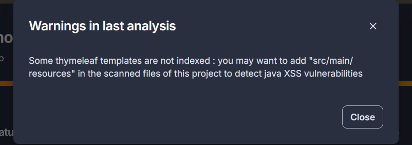
Sehingga yang saya lakukan adalah mengubah config sonarloud pada `build.gradle.kts` agar include static file
```
property("sonar.sources", "src/main")
```
Lalu terdapat masalah lagi pada config sonarcloud, dimana kalau kita lihat pada dashboard sonarcloud
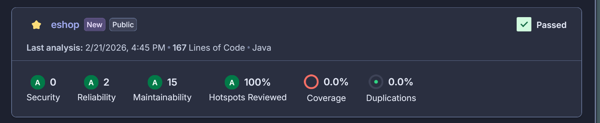
Dapat dilihat bahwa coverage pada repo ini 0% padahal pada report jacoco sendiri coveragenya sudah 100%. Dan setelah saya cari tahu lebih lanjut, ternyata sonarcloud hanya menerima input test berbentuk xml sedangkan default test dari jacoco sendiri outputnya adalah html. Oleh kerena itu saya mengubah config jacoco agar output xml juga
```
tasks.jacocoTestReport {
    dependsOn(tasks.test)
    reports{
        xml.required.set(true)
        html.required.set(true)
    }
}
```
Sehingga sonarcloud dapat menerima output jacoco tersebut
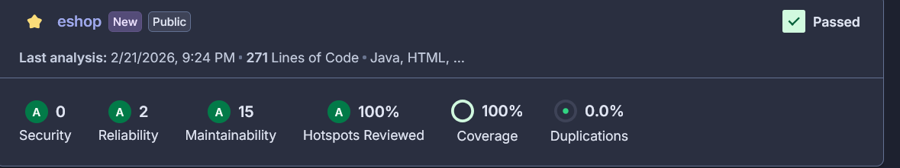

Untuk issue yang saya temukan pada sonarcloud adalah 15 issue
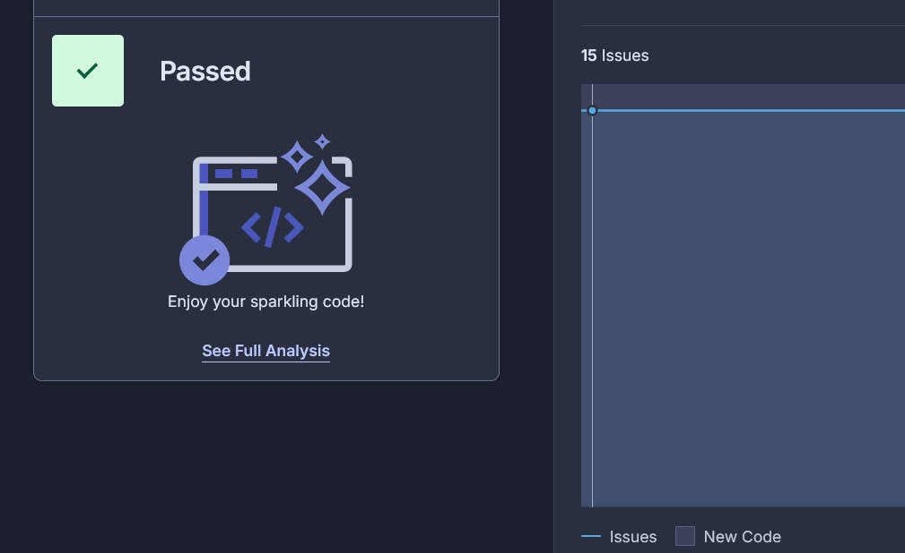
Untuk listnya sendiri
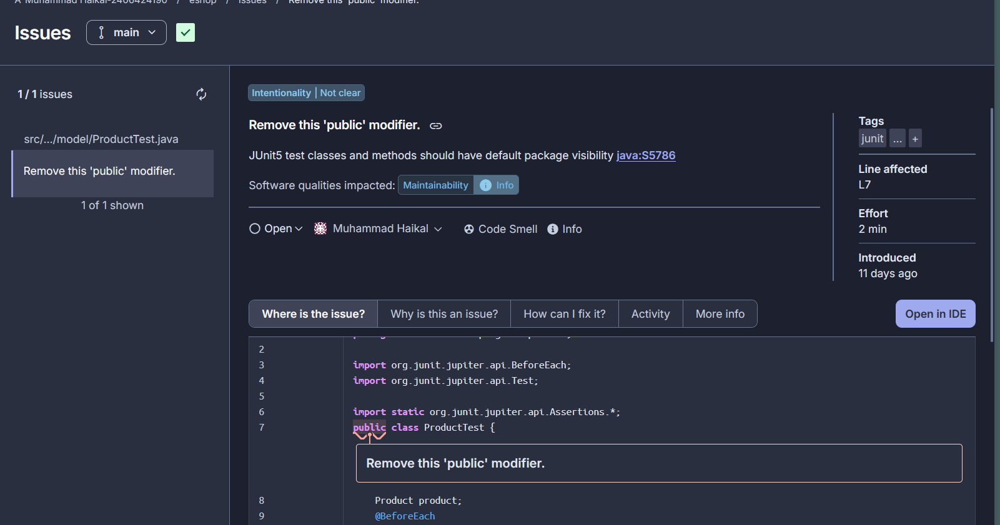
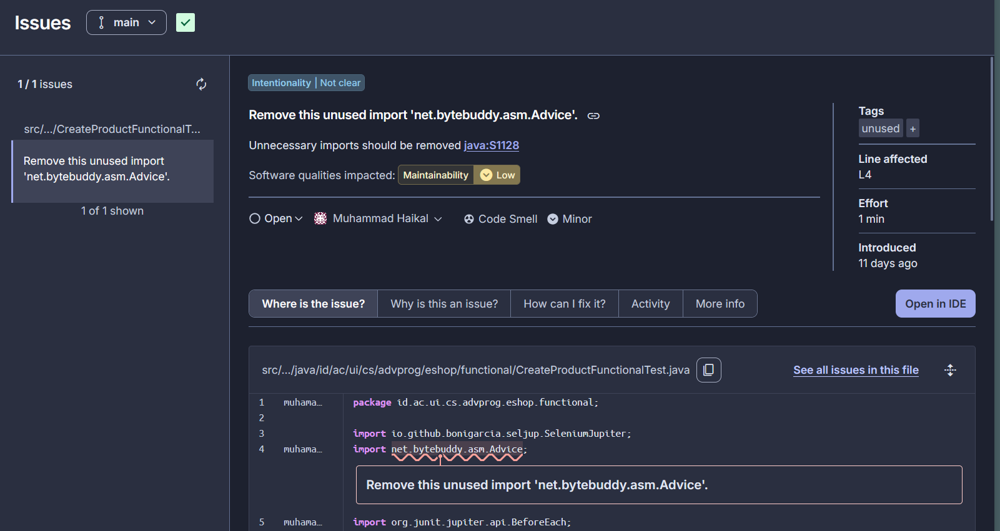
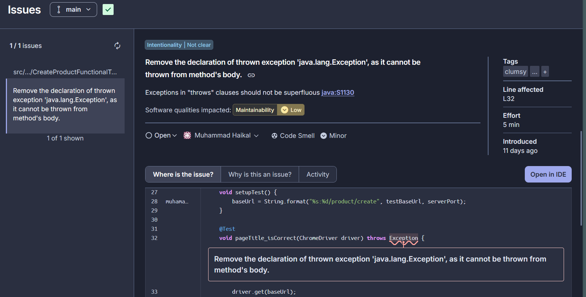
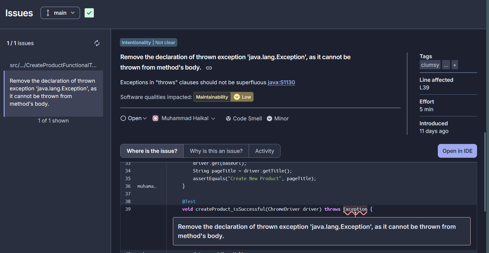
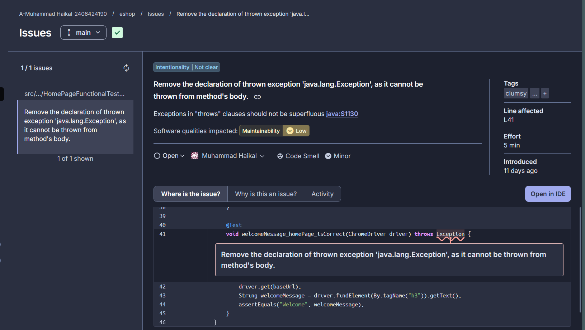
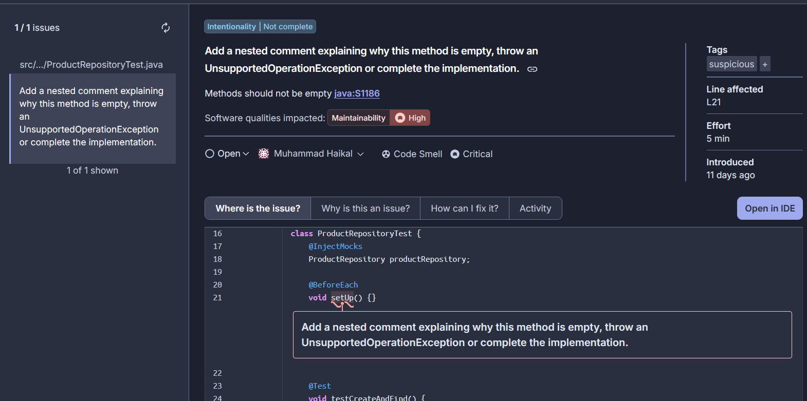
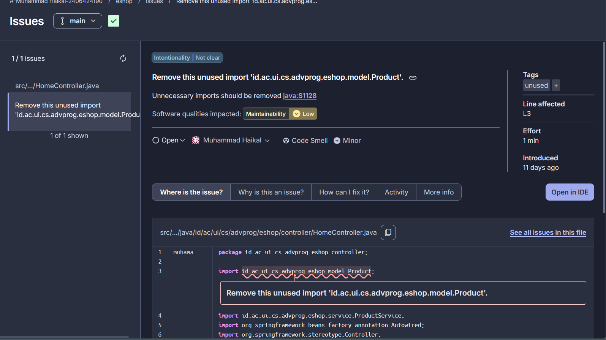
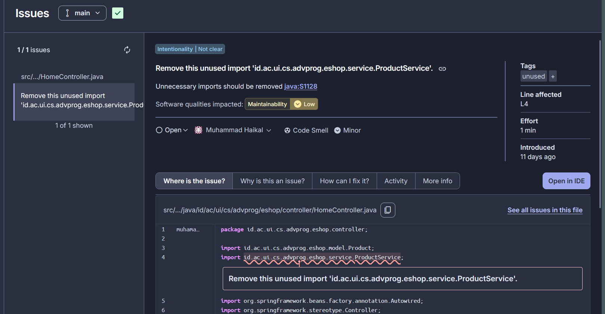

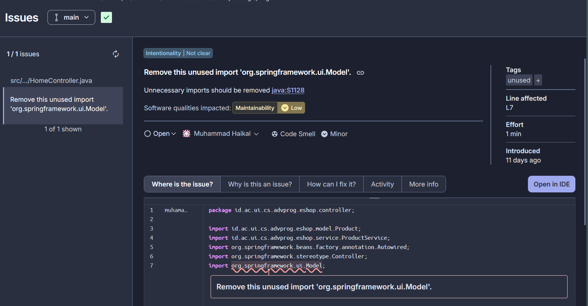
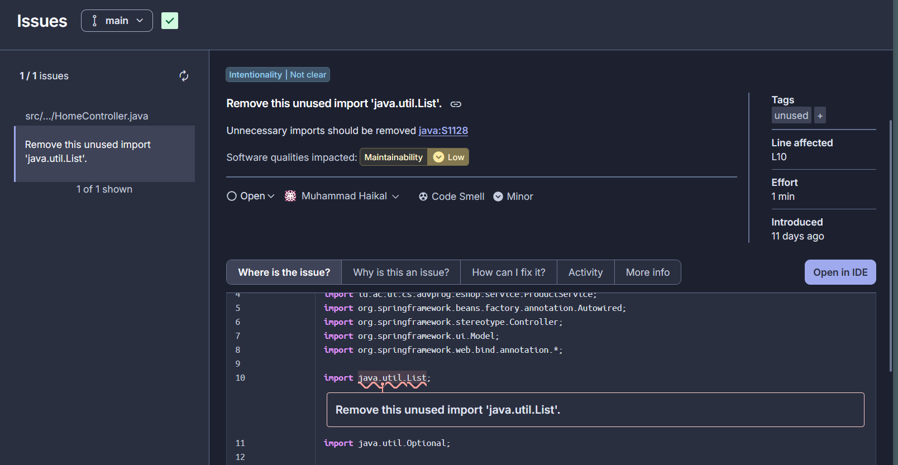
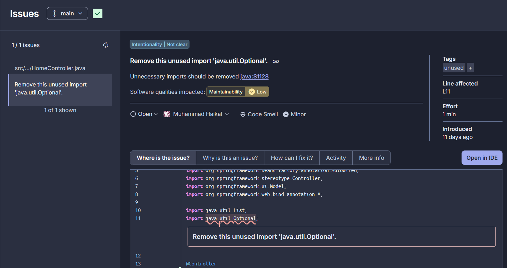

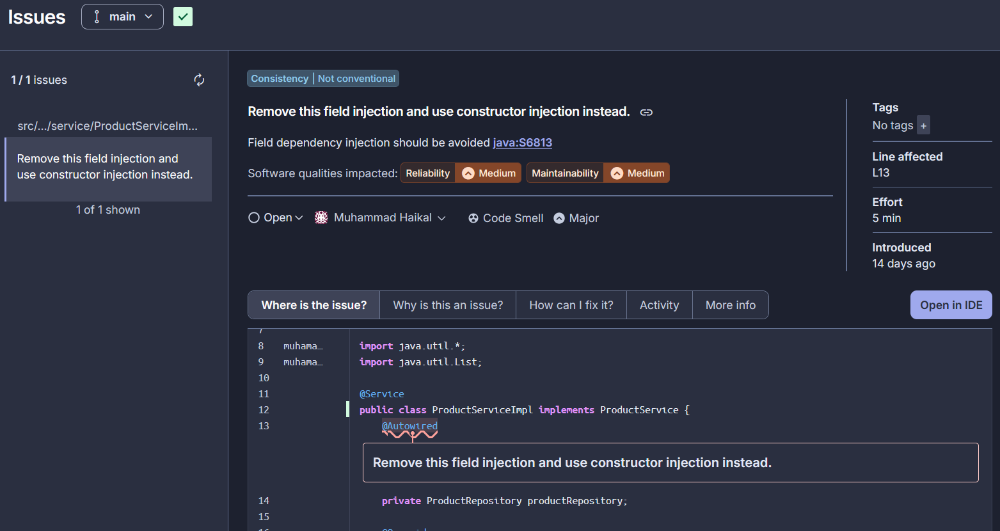
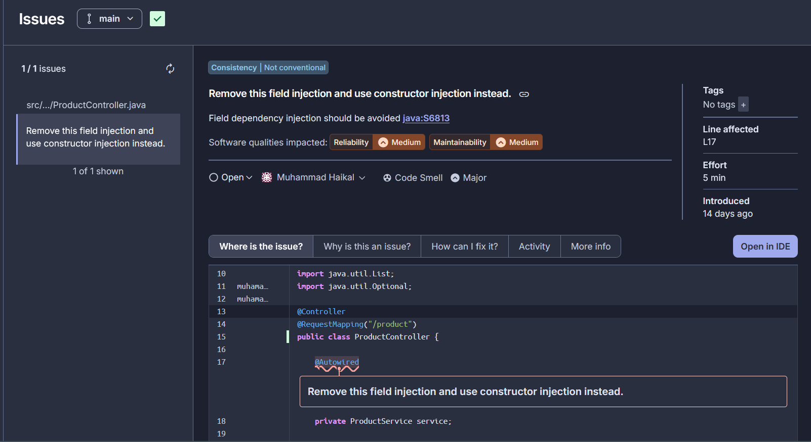

Untuk issue 1 saya cukup menghilangkan public pada class ini
```
public class ProductTest
```
Lalu untuk issue 2 - 5 saya cukup menghapus exception dan module yang tidak digunakan pada unitest
```
void pageTitle_isCorrect(ChromeDriver driver) throws Exception
```
Lalu untuk issue 6 - 12 saya cukup menghapus module import dan fucntion yang tidak digunakan yang tidak digunakan
```
@BeforeEach
    void setUp() {} // contohnya function ini
```
Lalu untuk  issue 13 - 15 saya mengubah dari yang menggunakan @autowired menjadi
```
private final ProductService service;
public ProductController(ProductService service) {
    this.service = service;
} // ini terjadi karena @autowired rawan terjadi class injection
```
Sejauh ini perbaikan yang saya lakukan adalah untuk menjaga maintainability dari repo ini
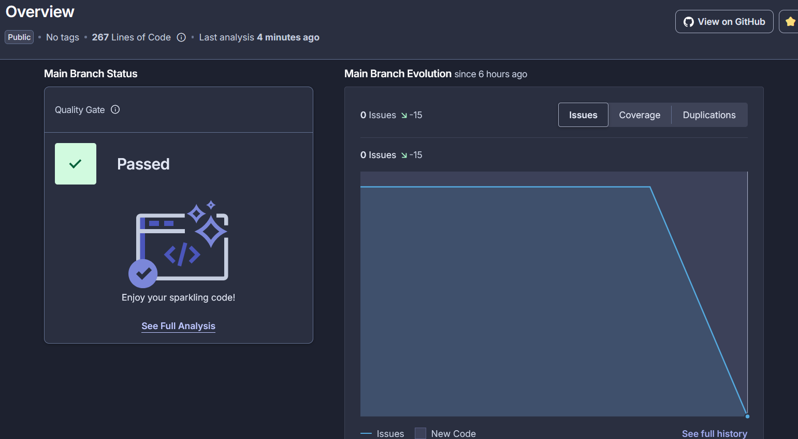

> Look at your CI/CD workflows (GitHub)/pipelines (GitLab). Do you think the current
implementation has met the definition of Continuous Integration and Continuous
Deployment? Explain the reasons (minimum 3 sentences)!


Berdasarkan file yml workflow saya, dapat dilihat bahwa worklow tersebut merupakan CI karena workflow tersenut akan otomatis mengeeksekusi code quality, code coverage test dan security test saat push ataupun pull request sehingga dapat diartikan sebagai Continuous Integration lalu pada CD sendiri, menurut saya repo ini sudah terdapat integrasi CD karena saya menggunakan auto deploy yang sudah otomatis akan deploy ketika terdapat push pada main branch, namun bagi saya ini bukan merupakan pipeline CD yang baik, dikarenakan belum adanya integrasi yang baik antara CI dan CDnya